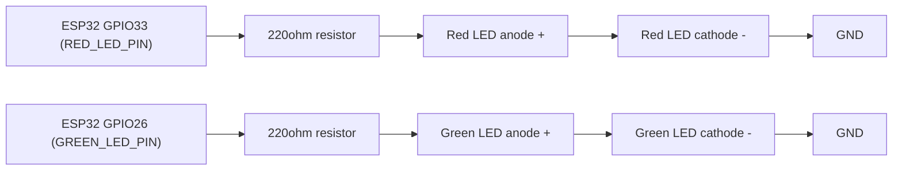
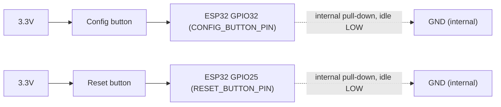
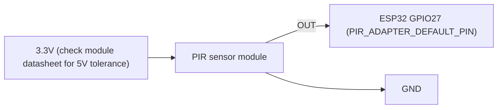
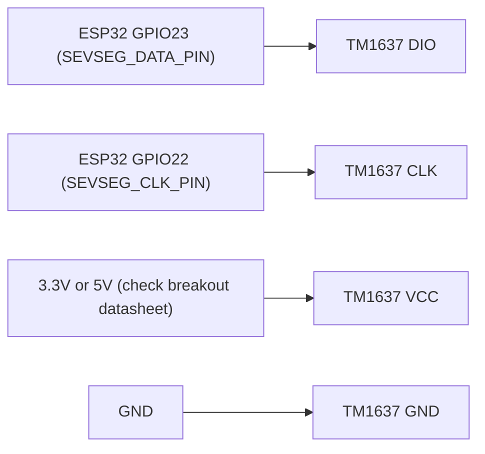

## Hardware requirements

This document describes the physical hardware this firmware targets: the bill of
materials, the exact GPIO pin assignment for each component, and wiring diagrams
for each. It is a companion to [`docs/adapter_development_guide.md`](adapter_development_guide.md)
(software-side adapter architecture) and [`docs/server_requirements.md`](server_requirements.md)
(serial/mesh wire protocol) — this doc covers only the physical build.

Pin numbers below are sourced directly from `firmware/main/project_config.h`
(`§4 "Hardware Pins"`) and `firmware/main/src/adapter/AdapterFactory.h`. If you change a
pin in either file, update this table to match.

---

### Bill of materials

| Qty | Component | Notes |
|-----|-----------|-------|
| 1 | ESP32 dev board | Target chip is `esp32` (set via `idf.py set-target esp32`, which writes `CONFIG_IDF_TARGET` to the generated, gitignored `firmware/sdkconfig` — not the checked-in `firmware/sdkconfig.defaults`). The original reference board was an ESP32-WROOM-DA; any ESP32 dev board with the pins below broken out is compatible. |
| 2 | LED (any color) | One is the system status/error LED, one is a secondary status LED. Each needs its own series current-limiting resistor — see [Power](#power) note below; the firmware does not manage resistor sizing. |
| 1 | Resistor, ~220Ω (x2) | Current-limiting resistor, one per LED. Exact value depends on the LED's forward voltage/current — 220Ω–330Ω is a safe default for standard 3.3V-logic LEDs. |
| 2 | Momentary push-button | One "config" button, one "reset" button. Simple 2-pin or 4-pin tactile switches both work. |
| 1 | PIR motion sensor module | 3.3V-logic output (e.g. HC-SR501-style). If your module's OUT pin is 5V logic, you need a level shifter — the firmware/GPIO cannot compensate for this (see [PIR sensor](#3-pir-motion-sensor-to-gpio-27) below). |
| 1 | TM1637 4-digit 7-segment display breakout | Common 2-wire (CLK/DIO) TM1637 breakout module. Check the specific breakout's datasheet for VCC tolerance (3.3V vs 5V) — see [Power](#power). |
| 1 | USB cable | For flashing and serial communication with the server (master node only; see `docs/server_requirements.md`). |
| — | Breadboard + jumper wires | For prototyping the wiring below. |

No specific PIR or TM1637 SKU is required by the firmware; any module exposing a
single digital OUT pin (PIR) or a standard CLK/DIO 2-wire interface (TM1637) will
work with the pin assignments below.

---

### Pin assignment table

| Signal | GPIO | Source constant | Header |
|--------|------|------------------|--------|
| Red LED (system error LED) | 33 | `RED_LED_PIN` | `project_config.h` §4 |
| Green LED | 26 | `GREEN_LED_PIN` | `project_config.h` §4 |
| Config button | 32 | `CONFIG_BUTTON_PIN` | `project_config.h` §4 |
| Reset button | 25 | `RESET_BUTTON_PIN` | `project_config.h` §4 |
| TM1637 DIO | 23 | `SEVSEG_DATA_PIN` | `project_config.h` §4 |
| TM1637 CLK | 22 | `SEVSEG_CLK_PIN` | `project_config.h` §4 |
| PIR sensor OUT | 27 | `PIR_ADAPTER_DEFAULT_PIN` | `AdapterFactory.h` |

`PIR_ADAPTER_DEFAULT_PIN` is defined in `AdapterFactory.h` (adapter layer), not
`project_config.h` — every other pin above is in `project_config.h`. `main.cpp`'s
`initDrivers()` references both headers directly when configuring GPIO at boot.

Note on `RESET_BUTTON_PIN`: GPIO 35 was deliberately avoided for this signal
because it is input-only and has no internal pull resistors on the ESP32; GPIO 25
was chosen so the firmware's internal pull-down (below) actually works.

---

### No external pull resistors needed

All GPIO pull-up/pull-down configuration is internal to the ESP32 and set **once**,
at boot, in `main.cpp`'s `initDrivers()`, before any component's own `init()` runs.
There are three `gpio_config_t` groups:

1. **Output group** — `{RED_LED_PIN(33), GREEN_LED_PIN(26), SEVSEG_DATA_PIN(23), SEVSEG_CLK_PIN(22)}`: `GPIO_MODE_OUTPUT`, pull-up disabled, pull-down disabled, interrupt disabled.
2. **Button input group** — `{CONFIG_BUTTON_PIN(32), RESET_BUTTON_PIN(25)}`: `GPIO_MODE_INPUT`, pull-up disabled, pull-down **enabled**, interrupt disabled.
3. **PIR input group** — `{PIR_ADAPTER_DEFAULT_PIN(27)}`: `GPIO_MODE_INPUT`, pull-up **enabled**, pull-down disabled, interrupt disabled (the edge-interrupt itself is armed separately, later, by `Pir::attachInterrupt()` once `PirAdapter::init()` runs).

Because of this, **no external pull-up or pull-down resistors are required** for
any of the components below — a technical reader can verify this directly against
`main.cpp`'s `initDrivers()` source. The one exception is the LEDs' series
current-limiting resistor, which is a basic LED circuit requirement unrelated to
GPIO pull configuration — see each diagram below.

---

### Wiring

#### 1. LEDs (GPIO 33 / GPIO 26)

Both LEDs are driven push-pull (no internal or external pull needed on the GPIO
itself), but each still needs its own series current-limiting resistor in the
physical circuit — this is standard LED practice and is not something firmware
can manage.

The red LED is the designated system error LED (`Led::setSystemErrorLed`), used
for boot-failure and runtime error indication; the green LED is the secondary
status LED, blinked as a fallback if the red LED itself fails to initialize.

#### 2. Buttons (GPIO 32 / GPIO 25)

Both buttons use the ESP32's internal pull-down (idle LOW, active-HIGH) — wire
each switch so pressing it connects the GPIO pin to 3.3V. No external pull-down
resistor is needed.

#### 3. PIR motion sensor (GPIO 27)

The PIR module's OUT pin connects directly to GPIO 27, which uses the ESP32's
internal pull-up as a safe idle default. Most common 3.3V-logic PIR modules
(e.g. HC-SR501-style) drive OUT actively HIGH/LOW, so the internal pull-up is a
convenience, not a strict requirement. If your module outputs 5V logic, add a
level shifter between the module's OUT pin and GPIO 27 — firmware has no control
over this.

#### 4. TM1637 7-segment display (GPIO 23 / GPIO 22)

The TM1637 breakout uses a 2-wire CLK/DIO interface plus power. Both DIO and CLK
are configured as plain push-pull outputs with pulls disabled at boot; the driver
only enables an internal pull-up on DIO transiently, at runtime, while sampling
the TM1637's open-drain ACK pulse. No external pull-up is needed for typical
TM1637 breakout modules.

---

### Power

ESP32 dev boards typically run off USB 5V, with an onboard regulator supplying
3.3V logic to the chip and its GPIO pins. The firmware assumes 3.3V logic
throughout (see the pull-up/pull-down configuration above). External modules —
the PIR sensor and the TM1637 display — should each be checked against their own
datasheet for VCC tolerance (3.3V vs 5V); firmware has no control over the power
wiring of external breakout modules, only over the logic-level GPIO signals
described above.
