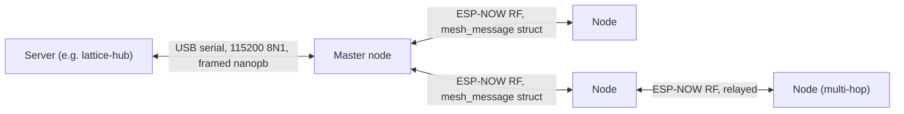

# Lattice server requirements (serial + mesh)

This document describes everything a server (the reference implementation is the sibling
`lattice-hub` repo) must implement to talk to a Lattice master node over USB serial. It covers the
serial transport, the wire schema, message types, control opcodes, and the enrollment/`JOIN_ACK`
protocol contract. **Every field name, tag number, and opcode value below has been verified
directly against the generated headers in this repo's `lattice-protocol` submodule (pinned at
`v0.6.0`) and the firmware source that encodes/decodes them** — see "Sources" at the end of this
document for the exact files and line ranges. If anything here appears to contradict the code,
trust the code and file an issue against this doc.

## Ecosystem context

`lattice-nodes` (this repo) is the ESP32 firmware. `lattice-hub` is the reference Go server that
implements the contract described in this document — its `server/orchestrator/` component owns
the serial connection, the mesh protocol logic, a REST API, and a Kafka producer. `lattice-protocol`
is the shared wire-format source of truth: a Go struct with dual `c:`/`proto:` tags that codegens
both the C headers this firmware vendors as a git submodule
(`firmware/main/lib/lattice-protocol/c/`) and the Go types `lattice-hub` imports as a module. Both
repos are currently pinned to protocol `v0.6.0`. This document only covers the firmware↔server wire
contract — for `lattice-hub`'s own internals, see that repo directly.

---

## 1. Topology overview

- Exactly one ESP32 node — **the master** — is connected to the server over USB serial.
- The master also participates in the ESP-NOW radio mesh with the other nodes. **The server never
  speaks ESP-NOW.** It talks only to the master, only over serial.
- The master bridges between the two: it translates serial-side messages into RF-side
  `mesh_message` frames and vice versa. These are related but **not identical** schemas — see
  §2 below, which is the single most important correction in this document.
- Serial settings: **115200 baud, 8N1**.



---

## 2. CRITICAL: the server does not see the raw RF wire struct

The single biggest error in the previous version of this document: **it described the server as
receiving the raw 200-byte `mesh_message` C struct that nodes exchange over ESP-NOW.** It does
not, and never has, in the current codebase.

There are **two different, related-but-distinct wire schemas** in this system:

1. **`mesh_message`** (`firmware/main/lib/lattice-protocol/c/mesh_message.h`) — the packed C
   struct exchanged over ESP-NOW between nodes and the master. `static_assert(sizeof(mesh_message)
   == 200)`. This is protocol v5 of the RF mesh wire format. It has 15 fields, including several
   (`route_len`, `route_path`, `auth_tag`, `auth_path`) that carry mesh-internal routing/crypto
   metadata.
2. **`mesh_MeshMessage`** (`firmware/main/src/mesh/serialization/mesh.pb.h`) — a separate,
   hand-maintained **nanopb** (protobuf-C) message that the master encodes to / decodes from over
   the USB-serial link. **This is the schema the server actually implements.** No `.proto` source
   file for this schema is checked into this repo — `mesh.pb.h`/`mesh.pb.c` are hand-authored
   nanopb output, not generated from a tracked `.proto`.

These two schemas are **not the same**, and not just in field count:

- The RF struct's `route_len`/`route_path`/`auth_tag`/`auth_path` fields exist in the submodule's
  canonical `proto/mesh.proto` (tags 12–14, 17) but the serial-side `mesh.pb.h` schema only carries
  three of them — `routeLen`(12)/`routePath`(13)/`authTag`(14) — as *dead, always-unset* fields (no
  `authPath` at all). `SerialFraming::encode()` (`firmware/main/src/adapter/serial/
  SerialFraming.cpp`) simply never populates them when building an outbound serial frame. **The
  server cannot see mesh topology (route paths) or AEAD tags today — full stop.** See §4 and §9.
- The serial schema additionally defines two fields the RF struct's canonical proto does not have
  at the top level at all: `secondaryMasterMac`(15) and `secondaryPublicKey`(16). These are a
  serial-only convenience projection of two 6/32-byte ranges inside the RF struct's `data[64]`
  payload (`data[4..10]` and `data[10..42]`) — see §8 for why.
- Even the fields both schemas nominally share are handled asymmetrically by the encoder/decoder —
  see §3.

**Why two schemas exist**: `mesh_message` is the RF/ESP-NOW mesh protocol, designed around what
relaying nodes need (routing metadata, AEAD tags, hop tracking). The serial link only ever talks to
one endpoint (the master) and one message shape flows in each direction, so the serial schema is
deliberately narrower — but because it was hand-authored rather than derived mechanically from the
RF proto, it has its own quirks (dead fields, an outdated `routePath` byte-array size — see §4) that
a server implementer needs to know about rather than infer from the RF proto.

---

## 3. Serial framing

Source: `firmware/main/src/adapter/serial/SerialFraming.h`/`.cpp`.

- **Framing**: a 2-byte little-endian length prefix, followed by that many bytes of a
  nanopb-encoded `mesh_MeshMessage` payload. Applies in both directions.
  - Master→server writes: `SerialAdapter::onMeshDataImpl` / `relayEnrollmentToServer`
    (`SerialAdapter.cpp`).
  - Server→master reads: `SerialFraming::injectByte()`'s state machine (`SerialFraming.cpp`).
- **Max payload**: 256 bytes (`MAX_PAYLOAD`). The nanopb schema's theoretical worst-case encoded
  size, if every optional field were set simultaneously, is 289 bytes (`mesh_MeshMessage_size` in
  `mesh.pb.h`) — larger than `MAX_PAYLOAD`. In practice this never happens: `routeLen`/`routePath`/
  `authTag` are never populated by `encode()` at all (§2/§4), and `public_key`/`secondaryMasterMac`/
  `secondaryPublicKey` are only ever populated together on a `JOIN_ACK`, which comfortably fits
  within 256 bytes on its own. The server does not need to special-case this — just be aware the
  master will reject/reset-parse any incoming frame declaring a length over 256 bytes.
- **Field population is asymmetric by direction and by message type** — this matters for what the
  server must and must not rely on:
  - **`SerialFraming::encode()`** (master→server, i.e. what the server reads) always sets:
    `messageType`, `dataType`, `hopCount`, `epochNum`, `seqNum`, `protoVersion`, all three MAC
    fields, and `data` (always the full 64 bytes). It conditionally includes `public_key` (only for
    `ENROLLMENT`/`JOIN_ACK` frames, and only if non-zero) and `secondaryMasterMac`/
    `secondaryPublicKey` (only for `JOIN_ACK`, and only if non-zero).
  - **`SerialFraming::decode()`** (server→master, i.e. what the server writes) has an important
    asymmetry: for **`JOIN_ACK` and `SERIAL_CMD_BROADCAST`** frames it trusts the server's
    `originMacAddress`/`lastHopMacAddress` values as sent. For **every other message type** it
    **overwrites** those two fields with the master's own MAC. In practice, nothing downstream
    currently reads `originMacAddress`/`lastHopMacAddress` off a server-sent `JOIN_ACK` or
    `SERIAL_CMD_BROADCAST` either (see §8's field table) — so today these two fields are
    effectively decorative for server→master traffic. Treat them as reserved/forward-compatible
    rather than load-bearing, and don't rely on either the master accepting or overwriting them.
  - `proto_version` is **not validated** on frames the master receives over serial (only on
    RF-received frames, where `!= PROTO_VERSION` causes a drop). The server can send any value here
    without it being rejected, though setting it correctly is still good practice.

**Minimum fields the server needs to populate on an outbound (server→master) frame**, based on what
firmware code paths actually consume, by message type:
  - `SERIAL_CMD_BROADCAST` (server→node commands): `messageType`, `dataType`, `targetMacAddress`,
    `data`. See §6/§7.
  - `JOIN_ACK` (enrollment approval): `messageType`, `targetMacAddress`, `public_key`, optionally
    `secondaryMasterMac`/`secondaryPublicKey`. See §8.
  - Everything else on an outbound frame (`originMacAddress`, `lastHopMacAddress`, `hopCount`,
    `epochNum`, `seqNum`, `protoVersion`, `routeLen`/`routePath`/`authTag`) is either overwritten,
    ignored, or not consumed by any current firmware code path for server→master traffic — don't
    spend engineering effort populating these precisely; leaving them zero-valued is safe.

---

## 4. Wire schema — the nanopb `mesh_MeshMessage` (what the server actually implements)

Source: `firmware/main/src/mesh/serialization/mesh.pb.h` (nanopb-generated; verified directly, not
just from research notes).

```proto
// NOT a tracked .proto file in this repo — this is the schema mesh.pb.h/.c
// implement, reconstructed here for the server team to generate code from.
syntax = "proto3";
package mesh;

message MeshMessage {
  uint32 messageType        = 1;  // one of MESH_TYPE_* — see §5
  sint32 dataType            = 2;  // zigzag-encoded — one of ADAPTER_TYPE_* — see §6
  bytes  originMacAddress    = 3;  // 6 bytes, fixed length
  bytes  targetMacAddress    = 4;  // 6 bytes, fixed length
  bytes  lastHopMacAddress   = 5;  // 6 bytes, fixed length
  optional bytes data        = 6;  // up to 64 bytes — opcode/application payload, see §7
  uint32 hopCount             = 7;
  uint32 epochNum             = 8;
  uint32 seqNum               = 9;
  uint32 protoVersion        = 10;
  optional bytes public_key         = 11; // 32 bytes — enrollment/JOIN_ACK pubkey, see §8
  optional uint32 routeLen          = 12; // DEAD FIELD — never set by encode(); see §2
  optional bytes  routePath         = 13; // DEAD FIELD — never set; 60-byte capacity (stale size, see note below)
  optional bytes  authTag           = 14; // DEAD FIELD — never set; AEAD tag never reaches serial
  optional bytes  secondaryMasterMac   = 15; // 6 bytes — dual-master, JOIN_ACK only, see §8/§9
  optional bytes  secondaryPublicKey   = 16; // 32 bytes — dual-master, JOIN_ACK only, see §8/§9
}
```

Field-by-field notes:

| Tag | Field | Purpose |
|---|---|---|
| 1 | `messageType` | One of the `MESH_TYPE_*` values — see §5's table. |
| 2 | `dataType` | Zigzag-encoded `sint32`. One of `ADAPTER_TYPE_*` — see §6's table. |
| 3 | `originMacAddress` | 6-byte MAC. Server-supplied value only honored for `JOIN_ACK`/`SERIAL_CMD_BROADCAST`, and even then not currently read downstream (§3). |
| 4 | `targetMacAddress` | 6-byte MAC, or `FF:FF:FF:FF:FF:FF` for broadcast. **The field the server must set correctly** for `SERIAL_CMD_BROADCAST` (broadcast/unicast discriminator — see §7) and `JOIN_ACK` (which node is being approved). |
| 5 | `lastHopMacAddress` | 6-byte MAC. Same caveat as `originMacAddress`. |
| 6 | `data` | Up to 64 bytes. This is the field the old doc got most wrong — it documented 12 bytes. The RF struct's `data[]` is 64 bytes and the serial schema mirrors that exactly (`PB_BYTES_ARRAY_T(64)` in `mesh.pb.h`). Opcode-defined layout, see §7. |
| 7 | `hopCount` | Not consumed by any server-facing firmware logic for server→master frames. |
| 8 | `epochNum` | Not consumed by any server-facing firmware logic for server→master frames — the master derives its own epoch/seq for any frame it originates in response. |
| 9 | `seqNum` | Same as `epochNum`. |
| 10 | `protoVersion` | Not validated on serial-received frames (§3). |
| 11 | `public_key` | 32-byte X25519 pubkey. **Load-bearing for `ENROLLMENT`/`JOIN_ACK`** — see §8. |
| 12 | `routeLen` | **Dead on the serial wire.** Never populated by `encode()`. Do not expect route-length data from the server-facing side. |
| 13 | `routePath` | **Dead on the serial wire.** Never populated. Note the nanopb struct's byte-array capacity is `PB_BYTES_ARRAY_T(60)` — an even older size than the RF struct's current 48-byte (`MAX_HOPS(8) × 6`) capacity — this mismatch is harmless precisely because the field is never set, but is a sign this schema was hand-maintained rather than kept in lockstep with the RF proto. |
| 14 | `authTag` | **Dead on the serial wire.** The AEAD tag never reaches the server — see §10. |
| 15 | `secondaryMasterMac` | 6-byte MAC. Only meaningful (and only ever set) on `JOIN_ACK`, and only when a secondary/failover master is being designated. See §8/§9. |
| 16 | `secondaryPublicKey` | 32-byte pubkey, paired with field 15. See §8/§9. |

---

## 5. Message types (`messageType` / `MESH_TYPE_*`)

Source: `firmware/main/lib/lattice-protocol/c/message_types.h` (verified directly against the
generated header — values below are exact).

| Value | Name | Direction (corrected) | Notes |
|---|---|---|---|
| 0 | `MESH_TYPE_ADAPTER_DATA` | device↔device (RF), **and** device→server over serial (master forwards it as-is) | Normal sensor/telemetry/health data. Also the on-mesh translation target the master builds when it turns a downlink `SERIAL_CMD_BROADCAST` into an RF frame — see §7. Sealed type (AEAD) on RF; plaintext by the time it reaches the server (§10). |
| 1 | `MESH_TYPE_MASTER_BEACON` | device↔device (RF) **only** | Topology heartbeat from the master. **Never crosses the serial link in either direction.** The mesh dispatch switch routes it only to `MasterBeacon::process`, which never calls the callback that forwards frames to the server. If your server implementation is waiting to see beacon traffic, it never will. |
| 2 | `MESH_TYPE_ENROLLMENT` | node→master (RF), then master→server (serial, via a dedicated relay path) | Enrollment request carrying the node's pubkey. See §8a. Reaches the server via a separate code path (`SerialAdapter::relayEnrollmentToServer`), not the general adapter-data forwarding path. |
| 3 | `MESH_TYPE_SERIAL_CMD_BROADCAST` | server→master (serial) **only** | **Never appears on RF.** The master always translates it into `MESH_TYPE_ADAPTER_DATA` (broadcast plaintext or sealed unicast, depending on `targetMacAddress`) before transmitting on the mesh. Do not model this as being relayed verbatim to a node. See §7. |
| 4 | `MESH_TYPE_JOIN_ACK` | server→master (serial), master→node (RF) | Enrollment approval. **The master does not relay the server's frame verbatim** — on receiving a valid server `JOIN_ACK`, it constructs an entirely new RF frame with different `origin_mac_address`/`enrollment_public_key`/`data` contents before broadcasting it. See §8c — this is a common source of confusion for a server implementer reading the RF-side code and assuming it describes what they send. |
| 5 | `MESH_TYPE_ROUTE_REPORT` | node→master (RF), master→server (serial) | Chain-MAC-authenticated route report. Sealed type (AEAD) on RF. Currently carries essentially no usable route data by the time it reaches the server — see §10. |

---

## 6. Adapter types (`dataType` / `ADAPTER_TYPE_*`)

Source: `firmware/main/lib/lattice-protocol/c/adapter_types.h` (wire/protocol-level enum, verified
directly) cross-checked against `firmware/main/src/adapter/Adapter.h` (firmware's own enum) and
`firmware/main/src/adapter/AdapterFactory.cpp` (what's actually constructible).

| Value | Name | Implemented in firmware today? |
|---|---|---|
| 0 | `ADAPTER_TYPE_UNKNOWN` | Yes (default/unconfigured state) |
| 1 | `ADAPTER_TYPE_SERIAL` | Yes (`SerialAdapter`) |
| 2 | `ADAPTER_TYPE_PIR` | Yes (`PirAdapter`) |
| 3 | `ADAPTER_TYPE_LED` | **No.** Reserved at the protocol level only. |
| 4 | `ADAPTER_TYPE_RELAY` | **No.** Reserved at the protocol level only. |

**This is a real gap the server team must know about before building against it.** The wire
protocol (the generated `adapter_types.h`) already reserves values 3 and 4 for LED and relay
adapters. But the firmware's own internal enum (`Adapter.h`) is a strict subset —
`UNKNOWN_ADAPTER=0, SERIAL_ADAPTER=1, PIR_ADAPTER=2` — with no LED/RELAY entries at all. There is no
`LedAdapter`/`RelayAdapter` class anywhere in this repo (confirmed by directory listing:
`firmware/main/src/adapter/` only has `pir/` and `serial/` subdirectories). `AdapterFactory::
createAdapter()` has switch cases only for `PIR_ADAPTER`/`SERIAL_ADAPTER`; any other value
(including 3 or 4) falls to `default:` and calls `err::fail(...)`.

**Practical consequence**: if the server sends `OP_CONFIG_SET` (§7) with adapter type 3 or 4, the
target node will accept the write, persist it to EEPROM, and reboot — and then **fail to construct
an adapter at boot**. Do not offer LED/RELAY as a selectable adapter type in server-side tooling
until firmware ships the corresponding adapter classes.

One EEPROM detail worth knowing: `AdapterFactory::adapterTypeToEEPROM`/`adapterTypeFromEEPROM` are
identity casts — the byte `OP_CONFIG_SET` writes to a node's EEPROM uses the same integer values as
this wire enum (0/1/2, and would be 3/4 once implemented). One special case: a factory-unset EEPROM
byte (`0xFF`) is read back as `PIR_ADAPTER`.

---

## 7. Control opcodes (`data[0]`, when `dataType == ADAPTER_TYPE_SERIAL`)

Source: `firmware/main/lib/lattice-protocol/c/opcodes.h` (verified directly), cross-checked against
the actual dispatch implementations in `firmware/main/src/adapter/Adapter.cpp` (the shared
`kControlOps[]` table — `OP_CONFIG_SET`, `OP_NODE_ID_SET`, `OP_HEALTH_REQ`, `OP_TX_POWER_SET` are
the only 4 opcodes with a real dispatch handler, invoked identically whether a frame arrives via the
mesh or direct serial) and `firmware/main/src/mesh/RouteReportHandler.cpp`.

| Opcode | Value | Direction | Payload | Behavior / caveats |
|---|---|---|---|---|
| `OP_HEALTH_REQ` | `0xB0` | server→node | `[B0]` (no body) | Only meaningful on the serial-attached master (`_adapterType == SERIAL_ADAPTER`); the master answers by sending its own health report. Routed to other nodes via mesh broadcast, but only a serial-attached device acts on it today. |
| `OP_HEALTH_REPORT` | `0xB1` | node(master)→server | `[B1][1B adapterType][6B mac][4B uptimeSec LE]` = 12 bytes | Sent only by the master about itself (`Adapter::sendSelfHealthReport`), wrapped at the `mesh_message`/`MeshMessage` level as `messageType=ADAPTER_DATA`, `dataType=SERIAL_ADAPTER` — note byte 1 of the payload also independently encodes the reporting adapter's type. |
| `OP_NODE_HEALTH` | `0xB2` | node(non-serial, e.g. PIR)→server, relayed via mesh | Same 12-byte layout as `OP_HEALTH_REPORT` | Sent by e.g. a PIR node's own health-report call. **Important**: this is transmitted at the `mesh_message` level with `dataType=ADAPTER_TYPE_SERIAL` (not the reporting node's own type), even though payload byte 1 correctly identifies the real adapter type. **The server should key off payload byte 1, not the wire `dataType`/`data_type`, to learn a reporting node's real adapter type.** |
| `OP_ROUTE_REPORT` | `0xB3` | node→server (nominal) | `[B3][1B path_len][path_len × 6B MACs]` per the opcode's own spec comment | **In current code this is not what's actually sent.** `RouteReportHandler::sendRouteReport()` always writes `data[1]=0` — the real hop-by-hop path lives in the RF struct's separate `route_len`/`route_path` fields, which never reach the serial wire (§2/§4). The server will receive an essentially-empty `[B3][0x00]` payload with no MAC list today, regardless of what the opcode's doc-comment implies. |
| `OP_NODE_ID_SET` | `0xC0` | server→node | `[C0][6B targetMAC (data[1..6])][1B nodeId (data[7])]` | Ignored unless the target MAC matches this node (broadcast `FF:FF:FF:FF:FF:FF` or an exact match) — see §7's targeting note below. Persists `data[7]` as the node's logical ID via EEPROM. |
| `OP_CONFIG_SET` | `0xC1` | server→node | `[C1][6B targetMac (data[1..6])][1B adapterType (data[7])]` | Ignored unless targeted at this node. On match: persists the new adapter type to EEPROM and calls `esp_restart()`. Handled once in the shared base `Adapter` dispatch table so every node type honors it regardless of its current adapter implementation. |
| `OP_TX_POWER_SET` | `0xC2` | server→node | `[C2][1B preset: 0=short, 1=indoor, 2=outdoor]` | Only meaningful on the serial-attached master; validates `preset <= 2`; applies via `esp_wifi_set_max_tx_power`. When it arrives directly over serial the master also re-broadcasts it to the rest of the mesh once (loop-prevented: a copy the master receives back via the mesh is not re-broadcast again). |
| `OP_LED_SOLID` | `0xD0` | server→output node | `[D0][1B r][1B g][1B b]` per spec | **Not consumed anywhere in firmware — no LED adapter exists (§6).** Additionally: the master's generic `SERIAL_CMD_BROADCAST`-to-unicast downlink path unconditionally reads `data[1..6]` as the destination MAC for *any* non-broadcast frame (§8's SERIAL_CMD_BROADCAST semantics) — which is inconsistent with this opcode's documented no-MAC `[D0][r][g][b]` layout. **Treat this opcode as "reserved, not yet wired up, payload convention unverified/likely-inconsistent" — do not build against it as a stable contract.** |
| `OP_LED_OFF` | `0xD1` | server→output node | `[D1]` (no body) | Same caveats as `OP_LED_SOLID`. Also collides at the byte level with a `SIMULATE_MODE`-only opcode (`OP_SIM_FAKE_BEACON`) — firmware explicitly warns `SIMULATE_MODE` must never ship in the same build as real LED handling. |
| `OP_LED_BLINK` | `0xD2` | server→output node | `[D2][r][g][b][interval_hi][interval_lo]` | Same caveats as `OP_LED_SOLID`. Also collides with a `SIMULATE_MODE`-only opcode (`OP_SIM_FAKE_PEER`). |
| `OP_RELAY_SET` | `0xD8` | server→output node | `[D8][0x00=off, 0x01=on]` | **Not consumed anywhere in firmware — no relay adapter exists (§6).** |
| `OP_COMMAND_ACK` | `0xE0` | node→server | `[E0][1B commandId]` per spec | **Never emitted anywhere in current firmware.** No send site exists for this opcode. Do not build server logic that waits for it. |

**Targeting for `OP_CONFIG_SET`/`OP_NODE_ID_SET`**: the destination is read from **`data[1..6]`**
(6 bytes, immediately after the opcode byte) — **not** from the `mesh_message`/`MeshMessage`-level
`targetMacAddress` field. This is confirmed both in firmware (`Adapter::isTargetedAtSelf(&message.
data[1])`) and in the reference test harness (`tests/e2e/harness/FakeHub.cpp`'s `sendConfigSet`,
which sets **both** `targetMacAddress` and `data[1..6]` to the same MAC for safety). **The server
should set both fields identically** — `targetMacAddress` still matters as the broadcast/unicast
discriminator for the transport layer (see next section), even though only `data[1..6]` is
currently load-bearing for the opcode's own node-targeting check.

### `SERIAL_CMD_BROADCAST` routing semantics (server→master, master translates to RF)

Source: `firmware/main/src/adapter/serial/SerialAdapter.cpp`.

```
if targetMacAddress == FF:FF:FF:FF:FF:FF:
    genuine broadcast → plaintext broadcast to all mesh peers (no destination MAC needed)
else:
    destMac = data[1..6]                      # ALWAYS bytes 1-6 of the payload, regardless of opcode
    → AEAD-sealed unicast to destMac, source-routed if the master has a known route, else a sealed
      broadcast flood
```

The master then builds a fresh RF `mesh_message` with `messageType = MESH_TYPE_ADAPTER_DATA` (never
`SERIAL_CMD_BROADCAST` — that type never appears on RF, §5), seals `data[64]` using the target
node's registered key material, and transmits.

**The key takeaway**: `targetMacAddress == FF:FF:FF:FF:FF:FF` is purely the broadcast/unicast
discriminator at the transport level. For a genuine unicast, **the actual RF destination the master
routes toward comes from `data[1..6]`**, not `targetMacAddress`. Today only `OP_CONFIG_SET`/
`OP_NODE_ID_SET` are confirmed to populate `data[1..6]` correctly for this purpose — the `OP_LED_*`/
`OP_RELAY_SET` opcodes' own doc-comments show no MAC field at that offset at all. **This is a real,
currently-unresolved inconsistency in the protocol spec, not something to paper over**: if the
server ever needs to unicast an `OP_LED_*`/`OP_RELAY_SET` command once those adapters ship, the
payload will very likely need a MAC at `data[1..6]` regardless of what the opcode's own
doc-comment says, purely because of how this routing layer works — but this has not been built or
tested and should not be assumed stable.

---

## 8. Enrollment / `JOIN_ACK` flow — the exact wire contract

This is the single most important contract in this document for the server team to get exactly
right — getting the fingerprint or master-pubkey semantics wrong here has real security
implications (see the TOFU note in §8d), not just functional bugs.

### 8a. Node → server: enrollment request

1. An unenrolled node broadcasts `MESH_TYPE_ENROLLMENT` (type 2) over RF, with
   `origin_mac_address` = its own MAC and `enrollment_public_key` = its own 32-byte X25519 pubkey.
2. The master receives it and — via a **separate, dedicated relay path** (not the general
   adapter-data forwarding pipeline) — relays it to the server over serial:
   `messageType=ENROLLMENT(2)`, `protoVersion=PROTO_VERSION`, `originMacAddress = <enrolling
   node's MAC>`, `public_key = <enrolling node's 32-byte pubkey>`. Everything else is zeroed.

**The server must record the node's pubkey from this message** — it has to echo it back in the
`JOIN_ACK`.

### 8b. Server → master: `JOIN_ACK` — exactly what the server must send

| Field (nanopb tag) | Required value |
|---|---|
| `messageType` (1) | `4` (`MESH_TYPE_JOIN_ACK`) |
| `targetMacAddress` (4) | MAC of the node being approved |
| `public_key` (11) | **The enrolling node's own 32-byte pubkey**, exactly as received in §8a. Used only as a 4-byte fingerprint check further downstream — see §8d, step 1. |
| `secondaryMasterMac` (15) — optional, dual-master only | MAC of a designated failover master, or omit/leave zero for single-master. See §9. |
| `secondaryPublicKey` (16) — optional, dual-master only | Pubkey of that failover master, or omit/leave zero. See §9. |
| `originMacAddress` (3), `data` (6), everything else | **Effectively unused/ignored** by the master's `JOIN_ACK` handler. It only checks `public_key` (non-zero = approve, all-zero = reject) and reads `targetMacAddress`; it does not inspect `originMacAddress` or the raw `data` bytes you send for this message type before acting. |

**Rejection**: if the server sends a `JOIN_ACK` with an all-zero `public_key`, the master logs
"Server rejected enrollment request" and takes no further action.

### 8c. Master → node: the actual over-the-air `JOIN_ACK` — the server does not control this directly

On receiving a valid server `JOIN_ACK`, the master does **not** relay the server's frame. It
constructs an **entirely new** RF `mesh_message` (`MeshMessenger::enrollPeer`,
`firmware/main/src/mesh/MeshMessenger.cpp`):

- `origin_mac_address` = **the master's own MAC** (not whatever the server sent)
- `target_mac_address` = the approved node's MAC
- `enrollment_public_key` = **the master's own pubkey** — so the enrolling node can register the
  master as an encrypted peer
- `data[0..4]` = first 4 bytes of the **enrolling node's** pubkey — this is the fingerprint the
  node checks against its own key (step 1 of §8d)
- `data[4..10]` = secondary master MAC (zero if none was supplied in §8b)
- `data[10..42]` = secondary master pubkey (zero if none)
- `data[42..64]` = zero
- Broadcast unsealed (plaintext) — `JOIN_ACK` is not one of the two AEAD-sealed message types.

This is a common point of confusion when reading firmware source: the RF-side `enrollPeer` code
describes what the **master** sends to the node, not what the **server** must send to the master —
those are two different frames with different field semantics, per §8b vs. this section.

### 8d. Node-side verification (`Enrollment::processJoinAck`, `firmware/main/src/mesh/Enrollment.cpp`)

In order:

1. **Fingerprint check**: `memcmp(msg.data, devicePublicKey, 4)` must match the node's own pubkey's
   first 4 bytes, or the frame is dropped.
2. **Master-pubkey pin check**: `msg.enrollment_public_key` must match the build-time-pinned master
   pubkey (unless `DEV_MODE`/a test-only bypass is active).
3. **TOFU origin gate**: once a master MAC is known to a node, only that MAC may deliver a
   `JOIN_ACK` to it going forward — this is what makes the master's origin-substitution in §8c
   security-meaningful rather than just a naming detail: it prevents an attacker from forging a
   `JOIN_ACK` claiming to come from an already-known master.
4. Registers the master as a peer using `enrollment_public_key` (so key derivation for later
   uplink/downlink traffic can happen), sets the node's `enrolled` flag, and TOFU-learns the master
   MAC if this is the node's first enrollment.
5. **Dual-master**: reads `data[4..10]`/`data[10..42]`; if non-zero, registers the secondary master
   as a peer too and TOFU-learns its MAC. See §9.

---

## 9. What the server does NOT need to implement

### Zero cryptography

The server implements **no cryptography whatsoever**. All key derivation and AEAD sealing/opening
happen entirely within the ESP32 mesh, between nodes and the master:

- Pairwise X25519 ECDH between a node and the master, split via HKDF-SHA256 into separate
  uplink/downlink keys. This is genuinely **end-to-end between the originating node and the master
  specifically** — not per-hop, and not node-to-server. Intermediate relay nodes forward sealed
  bytes opaquely; they cannot decrypt them either.
- ChaCha20-Poly1305 AEAD seals `data[64]`; the detached tag travels in `auth_tag[16]` on the RF
  wire only. Only `ADAPTER_DATA` and `ROUTE_REPORT` message types are ever sealed on RF —
  `ENROLLMENT`/`JOIN_ACK`/`MASTER_BEACON` are plaintext on RF too (their integrity instead comes
  from TOFU + pubkey/MAC pinning, per §8d).
- **The master unseals uplink frames itself before ever handing them to the serial-forwarding code
  path.** Combined with the fact that `auth_tag` is a dead field on the serial schema (§2/§4), the
  server never sees ciphertext or an AEAD tag at all — every frame it reads over serial is already
  plaintext. The mirror is true downlink: the server's plaintext serial command gets sealed
  transparently by the master before RF transmission; the server does nothing crypto-related on
  that path either.
- Separately, there is also a network-wide ESP-NOW PMK (a shared 16-byte link-layer radio key) —
  this is unrelated to the E2E AEAD above, entirely internal to the mesh, and irrelevant to the
  server/serial contract. Mentioned here only so it isn't confused with the E2E encryption
  described above.

**Bottom line**: build zero crypto into the server implementation. Every serial frame in either
direction is plaintext nanopb.

### No chain-MAC route verification, and no route data to verify

The RF mesh has a chain-MAC route-authentication mechanism (`RouteMac.h`) where each relay extends
a truncated HMAC-SHA256 chain to authenticate the plaintext route-path header as it accumulates
hop-by-hop, verified only at the master. As established in §2/§4, **none of `route_len`/
`route_path`/`auth_tag`/`auth_path` are ever serialized to the server** — this mechanism is entirely
invisible to, and irrelevant to, the server as currently implemented. The server neither validates
nor needs any route/topology data from `ROUTE_REPORT` frames today — the only thing a
`ROUTE_REPORT` frame currently tells the server is that a given `origin_mac_address` has mesh
connectivity (the frame arrived at all), not what path it took.

---

## 10. Dual-master

Source: `firmware/main/src/mesh/MasterBeacon.cpp`, `Enrollment.cpp`,
`tests/e2e/scenarios/test_dual_master_e2e.cpp`, `tests/e2e/harness/FakeHub.{h,cpp}`.

- The topology is **two independent physical ESP32 master nodes**, each with its own USB-serial
  connection to the server (each is its own serial-adapter-typed node from the mesh's point of
  view). There is no in-band wire indicator telling the server "this frame arrived via master A vs.
  master B" — that's implicit in which physical serial connection the frame arrived on.
- Nodes TOFU-learn a **primary** and, in dual-master deployments, a **secondary** master MAC —
  either passively from RF beacons (a weaker, RF-only fallback), or — the robust, server-driven
  path — from the `JOIN_ACK`'s `data[4..10]`/`data[10..42]` secondary-master fields (§8b/§8c/§8d).
- **What the server must actually do**:
  1. Track both masters' identities (MAC + pubkey) — this is a real, server-owned piece of state,
     not something the firmware provides automatically.
  2. When approving an enrollment relayed via the primary, optionally include the secondary
     master's MAC + pubkey in the `JOIN_ACK` (§8b) so the enrolling node learns its failover master
     up front.
  3. **Separately sync each node's pubkey to whichever master(s) need to be able to open that
     node's uplink traffic after a failover** — a node only performs the X25519 key exchange with
     the master it originally enrolled through. If the server wants a node's traffic to be readable
     by the secondary master too (i.e. full failover to actually work), it is the server's
     responsibility to register that node's pubkey with the secondary master out-of-band. This is a
     known, documented gap (see `docs/design-gaps/multihop-data-uplink.md`) — full automatic
     failover does not work without this server-side sync step today.
  4. After failover, a node's `CONFIG_SET`/uplink traffic is honored by the secondary using the same
     origin-allowlist check the primary uses (it checks "known master OR known secondary master").

This is, in contrast to route-report data (§9), a **real, server-visible feature** — the server
needs an explicit notion of "master identity pairs" and must actively supply secondary-master
designation plus cross-master pubkey sync as part of its own enrollment/config-management logic,
not just relay bytes blindly.

---

## Sources

All facts above were verified directly against this repo's working tree (not from memory or an
older doc) — the `lattice-protocol` submodule at commit `99cd30c` (tag `v0.6.0`), and:

- `firmware/main/lib/lattice-protocol/c/mesh_message.h` — RF wire struct
- `firmware/main/lib/lattice-protocol/c/message_types.h` — `MESH_TYPE_*` enum
- `firmware/main/lib/lattice-protocol/c/adapter_types.h` — `ADAPTER_TYPE_*` enum
- `firmware/main/lib/lattice-protocol/c/opcodes.h` — control opcode constants
- `firmware/main/lib/lattice-protocol/proto/mesh.proto` — the RF struct's own canonical proto (for
  contrast with the serial-only schema in §4)
- `firmware/main/src/mesh/serialization/mesh.pb.h` — the nanopb schema the serial link actually uses
- `firmware/main/src/adapter/serial/SerialFraming.h`/`.cpp` — framing + encode/decode
- `firmware/main/src/adapter/serial/SerialAdapter.h`/`.cpp` — serial-side message handling, `JOIN_ACK`/`SERIAL_CMD_BROADCAST` routing
- `firmware/main/src/adapter/Adapter.h`/`.cpp` — control-opcode dispatch table
- `firmware/main/src/adapter/AdapterFactory.cpp` — adapter construction, EEPROM byte mapping
- `firmware/main/src/mesh/Enrollment.cpp` — node-side enrollment/`JOIN_ACK` verification
- `firmware/main/src/mesh/MeshMessenger.cpp` — `enrollPeer`, `sendDownlinkToNode`
- `firmware/main/src/mesh/RouteReportHandler.cpp` — route-report send/receive, chain-MAC
- `tests/e2e/harness/FakeHub.h`/`.cpp` — reference test double for a server implementation
- `tests/e2e/scenarios/test_dual_master_e2e.cpp` — dual-master server responsibilities
